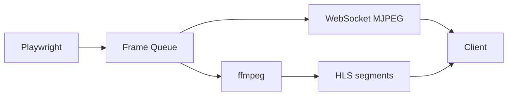

# Architecture Overview

This document outlines the proposed structure for evolving the Manus-style
agent into a collaborative, multi-agent automation system.

## Directory Structure

```
agent/            # Core agent logic and managers
dashboard/        # FastAPI routes serving dashboard UI
docs/             # Documentation
plugins/          # Pluggable extensions
prompts/          # LLM prompt templates
tools/            # Reusable tool implementations (browser, web search, ...)
workflows/        # User-defined automation pipelines
sessions/         # Session state and browser artifacts
logs/             # Persistent action logs and replay helpers
```

## API Highlights

| Method | Path                       | Description                            |
| ------ | -------------------------- | -------------------------------------- |
| POST   | `/token`                   | Obtain JWT token                        |
| GET    | `/status`                  | Health check                            |
| POST   | `/api/task`                | Plan a task with default agent         |
| POST   | `/agents`                  | Spawn sub-agent                         |
| GET    | `/agents`                  | List agents                             |
| POST   | `/agents/{id}/task`        | Send task to specific agent            |
| POST   | `/sessions`                | Create session with new agent          |
| GET    | `/sessions`                | List sessions                           |
| POST   | `/sessions/{id}/browser/start` | Start browser for session          |
| POST   | `/sessions/{id}/browser/command` | Control browser                    |
| GET    | `/sessions/{id}/browser/download` | Download screenshots             |
| GET    | `/sessions/{id}/log`       | Download action log                     |
| WS     | `/ws/session/{id}`         | Stream browser screenshots              |
| WS     | `/ws/chat/{room}`          | Collaborative chat channel              |
| GET    | `/dashboard`               | Placeholder dashboard endpoint          |

## Recommended Technologies

- **FastAPI** for REST and WebSocket APIs
- **Playwright**/Selenium for browser automation
- **pluggy** for a Python plugin ecosystem
- **React/Next.js** or **SwiftUI** for clients consuming the API and streams
- **SQLite or Redis** (future) for session/state persistence

## Streaming pipeline



## Sample WebSocket Subscription (JavaScript)

```javascript
const ws = new WebSocket("ws://localhost:8001/ws/session/SESSION_ID");
ws.onmessage = ev => {
  const img = document.getElementById("view");
  img.src = `data:image/png;base64,${ev.data}`;
};
```

## Implementation Roadmap

1. **Streaming & Recording** – broadcast browser frames to multiple clients and
   optionally persist them for replay.
2. **Collaboration** – build chat and control channels so users can comment or
   interrupt tasks in real time.
3. **Multi-agent Core & Session Management** – expand `AgentManager` and
   `SessionManager` for cooperative planning and persistent state.
4. **Dashboard UI** – integrate a frontend (React/Next.js) that visualises
   active agents, tasks, and browser previews.
5. **Workflow Editor** – create a node-based editor using libraries such as
   React Flow or SwiftUI diagrams to define automation pipelines.
6. **Plugin System** – load external integrations via `pluggy` entry points.
7. **Human-in-the-loop** – surface prompts when CAPTCHA/2FA or errors occur,
   allowing manual intervention.
8. **Role Profiles** – provide configurable agent personas selectable via API.

